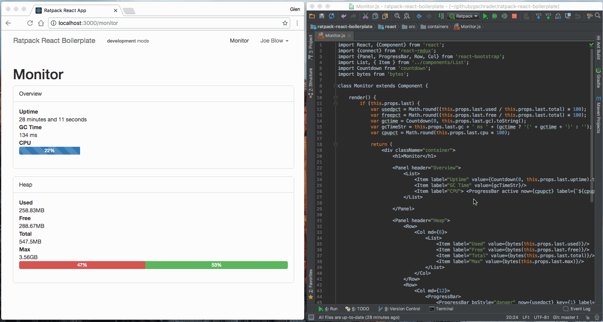

ratpack-react-boilerplate
=====================

The minimal dev environment to enable live-editing React components from a ratpack server.
Derived from this [example](https://github.com/gaearon/react-transform-boilerplate)

### Usage

```
gradlew npmInstall
gradlew npm_start
gradlew run
open http://localhost:5050/dev
```

Now edit `src/main/resources/App.js`.
Your changes will appear without reloading the browser like this:




### Deployment

The gradle assemble will create the javascript artifact required and serve the non-hot-loading version at the root:
 i.e. http://localhost:5050
